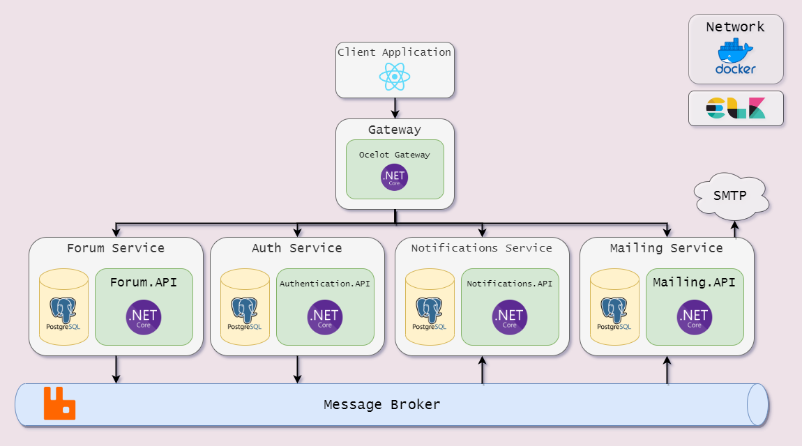

# Knowledge market system

Using this service you can ask questions, give answers, set answers as best for the question.
You will be notified when someone answers you.

This project demonstrates a simple microservices-like system. To start this application just run "docker-compose up"
command at the root of the repo.

There is an architecture diagram:

## Service responsibility:

* Authentication service is used only to create user or to give access to users.
* Forum service is a domain backend. It allows users to ask questions, give answers. Users are also allowed to edit or
  delete their entities such as questions or answers.
* Notifications service is used to generate notifications for users. Every user will know when he gets answered.
* Mailing service is similar to notification service, but it uses a smtp channel to notify users using email.

### Default service endpoints:

* Client React App - http://localhost:3080
* MailDev - http://localhost:8080
* RabbitMq Web Interface - http://localhost:15672
* Postgres - localhost:5433
* Kibana - http://localhost:5601

## Note

I am neither full-stack nor front-end developer. The reason why i tried to develop a client application is to allow
users to interact with whole system.

###Inspired by:
* [Stackoverflow](https://stackoverflow.com/)
* [PitStop](https://github.com/EdwinVW/pitstop)
* [Clean Architecture](https://github.com/ardalis/CleanArchitecture)